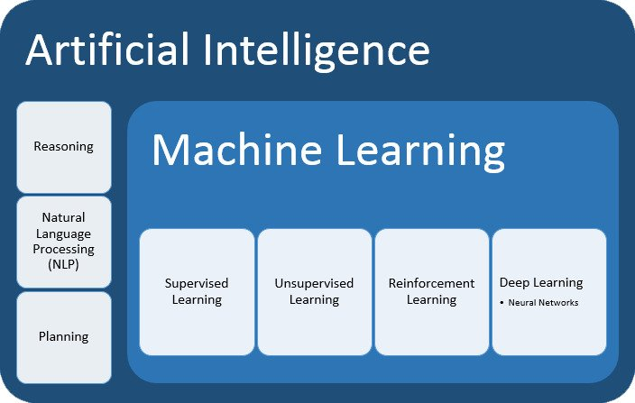
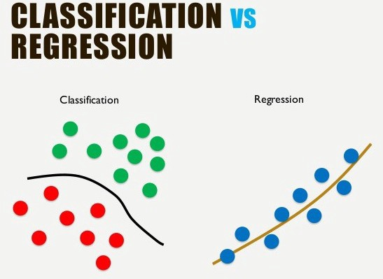
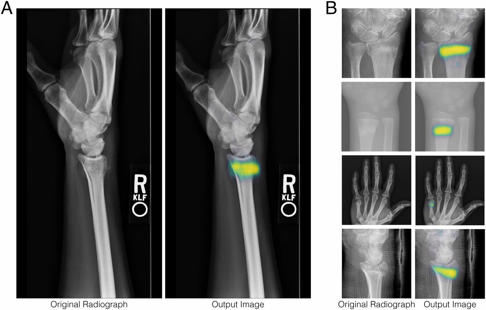

About me
========

[{height="90px"}](https://louisabraham.github.io/)

Louis Abraham
-------------

-   Education: École polytechnique (Paris), ETH Zurich

-   Experience:

    -   Quant @ BNP Paribas

    -   Deep learning @ EHESS / ENS Ulm

    -   Data protection @ Qwant Care

Artificial Intelligence vs Machine Learning
===========================================

**One takeaway:**

-   AI is about cognition: creative thinking, critical reasoning,
    autonomous learning, self awareness, ...
-   ML is about data: signal processing, image classification, assisted
    diagnosis, risk assessment, ...

In practice, tasks lie on a spectrum and it is not simple to decide if
AI is attained.

{height="150px"}

Vocabulary checkpoint
=====================

-   **Data**: digital information stored in a file
-   **Format**: specification for encoding information in files

-   **Algorithm**: specification for processing data
-   **Model**: an algorithm that can be trained on data and make
    predictions
-   **Program / Application**: what you run on a computer, often
    includes algorithms

-   **Server**: a remote computer
-   **Cloud**: servers in general

3 predicates of Machine Learning: a view on empiricism
======================================================

1.  A machine can get measurements from the world and store them
    digitally
2.  Patterns exist in the data collected by machines
3.  Algorithms can infer and reproduce those patterns in a reasonable
    amount of time on existing computers

{height="130px"}
{height="130px"}

AI is already in our lives
==========================

-   Google search

-   Speech recognition

-   Personal assistant (Google, Siri)

-   Facebook face recognition

-   Recommendations on YouTube, Netflix, Amazon...

{height="100px"}

ML tasks
========

-   Classification
-   Regression
-   Detection

{height="140px"}
{height="140px"}

And many others...

ML isn't always complicated
===========================

-   Constant model: (almost) everybody has 2 arms, 2 legs, 2 eyes, 1
    head, etc...

-   Threshold model
    -   hemoglobin \< 130 g/L $\rightarrow$ anemia
    -   Body Mass Index $\ge$ 25 $\rightarrow$ overweight

Note: $BMI = c \frac{weight}{height^2}$

Most classification models are in fact threshold models with more
complicated formulas.

Applications of AI in Healthcare
================================

-   Monitoring

-   Computer-aided diagnosis

-   Computer-assisted surgery

-   Chatbots for patient care

-   ...

An example of computer-aided diagnosis
======================================

Application of deep convolutional neural network for automated detection of myocardial infarction using ECG signals [@acharya2017application]
---------------------------------------------------------------------------------------------------------------------------------------------

{height="200px"}

An example of computer-aided diagnosis
======================================

Application of deep convolutional neural network for automated detection of myocardial infarction using ECG signals [@acharya2017application]
---------------------------------------------------------------------------------------------------------------------------------------------

{height="200px"}

An example of computer-aided diagnosis
======================================

Application of deep convolutional neural network for automated detection of myocardial infarction using ECG signals [@acharya2017application]
---------------------------------------------------------------------------------------------------------------------------------------------

ECG data collected on 200 subjects (148 MI and 52 healthy subjects)

Data source: PTB Diagnostic ECG Database

Only used 1 lead out of 12 (lead II)

Total: 10,546 normal ECG beats and 40,182 MI ECG beats

An example of computer-aided diagnosis
======================================

Application of deep convolutional neural network for automated detection of myocardial infarction using ECG signals [@acharya2017application]
---------------------------------------------------------------------------------------------------------------------------------------------

Accuracy: 93.53% with noise, 95.22% without noise

Sensitivity: 93.71%, 95.49%

Specificity: 92.83%, 94.19%

{width="400px"}

Other examples in cardiology
============================

-   Mortality prognosis and risk stratification in heart failure
    [@ortiz1995one; @atienza2000risk]
-   Echocardiographic imaging analysis [@narula2017reply]
-   Prediction on the development of atrial fibrillation
    [@kolek2016evaluation]
-   Prediction of cardiovascular event risk [@pavlou2015develop]
-   Prediction of in-stent restenosis from plasma metabolites
    [@cui2017plasma]
-   Real-time patient-specific ECG classification [@kiranyaz2015real]
-   Automatic tissue classification of coronary artery
    [@abdolmanafi2017deep]
-   Early detection of heart failure onset [@choi2016using]

Conclusion
==========

-   Machine Learning can save lives

-   The main challenges are data collection and technological
    integration

-   Doctors will (probably) never be replaced by robots, but they can
    learn about them

 

{height="100px"}

Image sources
=============

<https://www.ibm.com/analytics/machine-learning>

<https://www.labmanager.com/leadership-and-staffing/2018/03/creating-a-successful-laboratory-training-program>

<https://www.ebuyer.com/blog/wp-content/uploads/2015/11/server_farm.jpg>

<https://www.usinenouvelle.com/article/les-gafa-dans-le-viseur-de-la-justice-americaine-pour-leurs-pratiques-concurrentielles.N869415>

<https://chatbotsmagazine.com/lets-know-supervised-and-unsupervised-in-an-easy-way-9168363e06ab>

<https://www.pnas.org/content/115/45/11591>

References {#references .allowframebreaks}
==========
